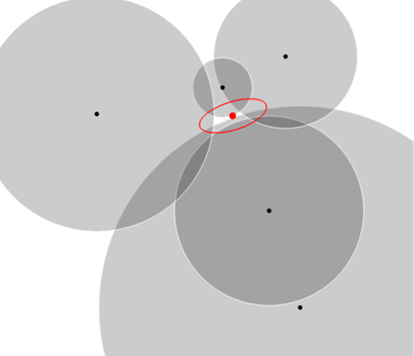

# Trilateration

Solves a formulation of n-D space trilateration problem using a nonlinear least squares optimizer.

**Input:** positions, distances  
**Output:** centroid with geometry and error  

Uses [Levenberg-Marquardt algorithm](http://en.wikipedia.org/wiki/Levenberg%E2%80%93Marquardt_algorithm) from [Apache Commons Math](http://commons.apache.org/proper/commons-math/).

    double[][] positions = new double[][] { { 5.0, -6.0 }, { 13.0, -15.0 }, { 21.0, -3.0 }, { 12.4, -21.2 } };
    double[] distances = new double[] { 8.06, 13.97, 23.32, 15.31 };

    NonLinearLeastSquaresSolver solver = new NonLinearLeastSquaresSolver(new TrilaterationFunction(positions, distances), new LevenbergMarquardtOptimizer());
    Optimum optimum = solver.solve();

    // the answer
    double[] centroid = optimum.getPoint().toArray();

    // error and geometry information; may throw SingularMatrixException depending the threshold argument provided
   	RealVector standardDeviation = optimum.getSigma(0);
   	RealMatrix covarianceMatrix = optimum.getCovariances(0);

The multilateration problem can be formulated as an optimization problem and solved using [Non-linear least squares methods](https://en.wikipedia.org/wiki/Non-linear_least_squares).  A well-formed solution will be an ellipse in R2, or an ellipsoid in R3.  If you are only interested in a maximum likelihood point estimate, the centroid is also provided.  R2 space requires at least 3 non-degenerate points and distances to obtain a unique region; and similarly R3 space requires at least 4 non-degenerate points and distances to obtain a unique region.

## Run the tests

### *nix

./gradlew clean  
./gradlew test -i

### Windows
./gradlew.bat clean  
./gradlew.bat test -i
